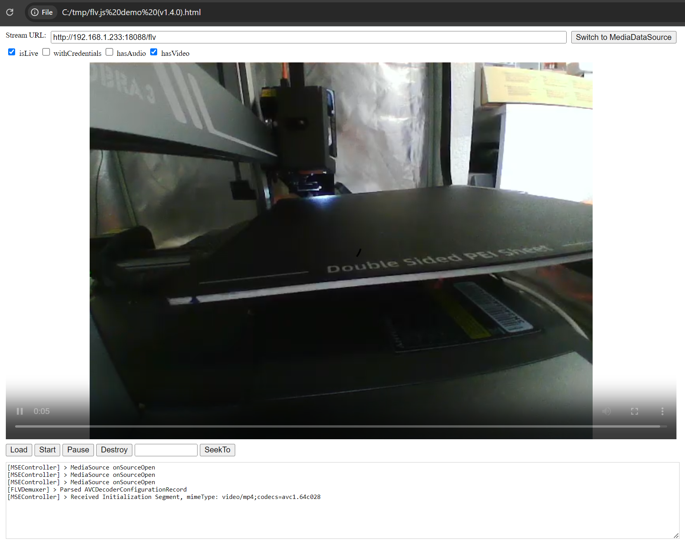
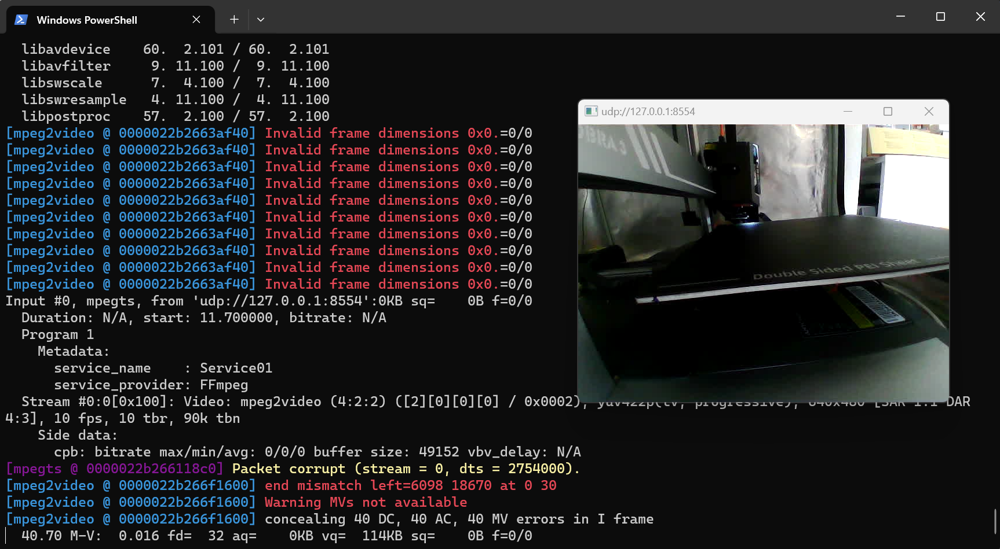

# Kobra 3 Camera info

Camera is managed via the **gkapp** in the printer.

This app is streaming video with the **flv** protocol (Flash Video often used in chinese products).

The stream is available here :

Link : **http://<printer-IP>:18088/flv**

A website with some info about FLV : https://www.yanxurui.cc/posts/server/2017-11-25-http-flv/

Stream will not work unless the stream is started at printer level. The start of streaming is executed by an mqqt call to the following topic :

## anycubic/anycubicCloud/v1/web/printer/20024/7bc0c9835db51d839d6fcf0bb0bb40f8/video

With the following info :
```
{
      "type": "video",
      "action": "startCapture",
      "timestamp": 1660201929871,
      "msgid": "02fd3987-a2ff-244e-7c95-7fe257a9ef70",
      "data": null
    }
```
And stopped with :
```
{
      "type": "video",
      "action": "stopCapture",
      "timestamp": 1660201929871,
      "msgid": "02fd3987-a2ff-244e-7c95-7fe257a9ef70",
      "data": null
    }
```

You can start the stream via the anycubic slicer application or the mobile app and then access the stream with the flv webpage demo provided here. (Based on https://github.com/bilibili/flv.js/tree/master)

.

## Hardware info :

http://www.szxcz.com/en/product-34-1.html

You can as well run ffmpeg and stram the video to an external host. (more info to come if no better solution is found)

.

## Linux information :

Dmesg info :
```
[    6.361659] uvcvideo: Found UVC 1.00 device USB 2.0 Camera (0c45:6366)
[    6.370324] input: USB 2.0 Camera: USB Camera as /devices/platform/usbdrd/ffb00000.usb/xhci-hcd.0.auto/usb1/1-1/1-1.1/1-1.1:1.0/input/input1
[    6.371085] evbug: Connected device: input1 (USB 2.0 Camera: USB Camera at usb-xhci-hcd.0.auto-1.1/button)
```

When connected to another PC the device is seen as :

```
Bus 001 Device 003: ID 0c45:6366 Microdia Webcam Vitade AF
```

This camera has lights but from what I've seen they cannot be managed via the current binaries/tools available on the machine.

```
UDEV  [8605.472463] add      /devices/platform/usbdrd/ffb00000.usb/xhci-hcd.0.auto/usb1/1-1/1-1.1/1-1.1:1.0/video4linux/video10 (video4linux)
ACTION=add
DEVLINKS=/dev/v4l/by-id/usb-Sonix_Technology_Co.__Ltd._USB_2.0_Camera_SN0001-video-index0 /dev/v4l/by-path/platform-xhci-hcd.0.auto-usb-0:1.1:1.0-video-index0
DEVNAME=/dev/video10
DEVPATH=/devices/platform/usbdrd/ffb00000.usb/xhci-hcd.0.auto/usb1/1-1/1-1.1/1-1.1:1.0/video4linux/video10
ID_BUS=usb
ID_MODEL=USB_2.0_Camera
ID_MODEL_ENC=USB\x202.0\x20Camera
ID_MODEL_ID=6366
ID_PATH=platform-xhci-hcd.0.auto-usb-0:1.1:1.0
ID_PATH_TAG=platform-xhci-hcd_0_auto-usb-0_1_1_1_0
ID_REVISION=0100
ID_SERIAL=Sonix_Technology_Co.__Ltd._USB_2.0_Camera_SN0001
ID_SERIAL_SHORT=SN0001
ID_TYPE=video
ID_USB_DRIVER=uvcvideo
ID_USB_INTERFACES=:0e0100:0e0200:
ID_USB_INTERFACE_NUM=00
ID_VENDOR=Sonix_Technology_Co.__Ltd.
ID_VENDOR_ENC=Sonix\x20Technology\x20Co.\x2c\x20Ltd.
ID_VENDOR_ID=0c45
MAJOR=81
MINOR=11
SEQNUM=1273
SUBSYSTEM=video4linux
USEC_INITIALIZED=5471899
```

The available option for the camera are (no led in sight):

```
root@Rockchip:/useremain/camera/lib# v4l2-ctl -d /dev/video10 -l
                     brightness (int)    : min=-64 max=64 step=1 default=0 value=0
                       contrast (int)    : min=0 max=64 step=1 default=32 value=32
                     saturation (int)    : min=0 max=128 step=1 default=85 value=85
                            hue (int)    : min=-40 max=40 step=1 default=0 value=0
 white_balance_temperature_auto (bool)   : default=1 value=1
                          gamma (int)    : min=72 max=500 step=1 default=100 value=100
                           gain (int)    : min=0 max=1 step=1 default=0 value=0
           power_line_frequency (menu)   : min=0 max=2 default=1 value=1
      white_balance_temperature (int)    : min=2800 max=6500 step=1 default=4600 value=4600 flags=inactive
                      sharpness (int)    : min=0 max=6 step=1 default=3 value=3
         backlight_compensation (int)    : min=0 max=8 step=1 default=2 value=2
                  exposure_auto (menu)   : min=0 max=3 default=3 value=3
              exposure_absolute (int)    : min=1 max=5000 step=1 default=156 value=156 flags=inactive
         exposure_auto_priority (bool)   : default=0 value=1
```

One interesting post from 12 years ago (tested on ubuntu with anycubic camerawithout much success either): https://www.linuxquestions.org/questions/linux-hardware-18/how-to-control-leds-from-usb-webcam-4175443370/

